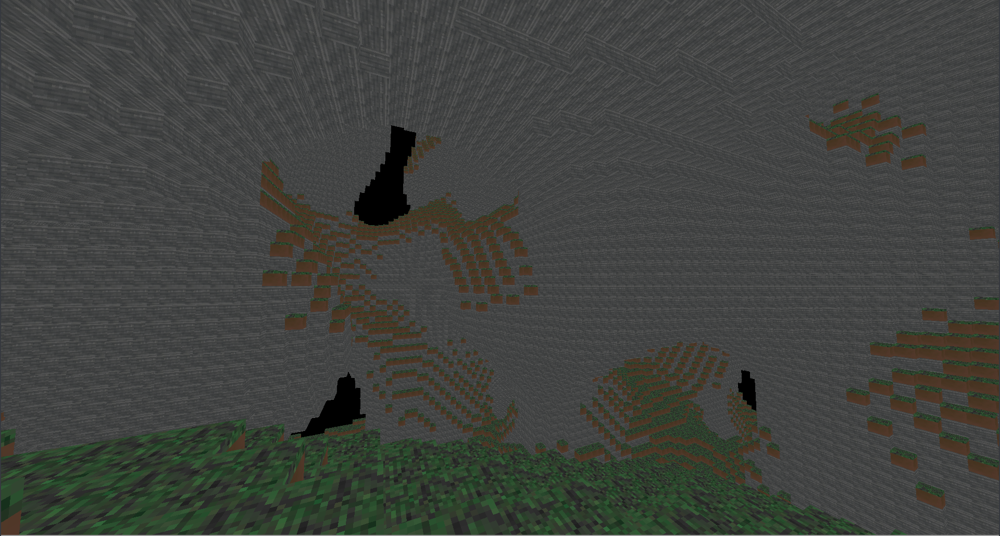

# Vulkan Voxel Renderer



This project is a simple voxel renderer made using Vulkan and C.
It's a small demo example and not a full game,
but it successfully demonstrates the basic principles of building texture atlases, chunk generation, and dynamic chunk loading without a game engine

This project's code and assets are 100% public domain, and you can do whatever you like with them.

### Current Features
* Chunks
  * Internal faces are culled
* Infinite terrain
  * Chunks are loaded and unloaded dynamically
* Textured blocks
  * Texture atlas is generated at runtime from the resources in `assets/blocks`
* Can move camera
  * Spectator mode (no physics currently)

### Goals
We will add these later at some point, but they're not present right now:

* Destroying blocks
* Adding blocks
* Being able to walk around without flying
* Entities
* Block picker

### Non-Goals
These are pretty cool features for a game, but they aren't really core to the concept of a voxel renderer.

* Lighting
* Water / Transparency
* Inventory support

## How to build

Before you can run the program, you need to ensure that you have installed the Vulkan libraries and headers.

```bash
$ cd assets/shaders
$ ./compile.sh
$ cd ..
$ make
```

Run from the project root directory.

```bash
$ ./obj/vulkan-triangle-v2
```

## How to modify image assets
Block textures can be found in the `assets/blocks/` directory.
These textures are in the [farbfeld](http://tools.suckless.org/farbfeld/) format.
If you want to edit these files, you can use ImageMagick tools to convert them to png format,
and then back again to farbfeld format once you are done editing.

Example:
```bash
$ convert up.ff up.png
```

## Credits and Acknowledgments
Part of this project is based upon <https://vulkan-tutorial.com>.

I also referenced my prior example project: <https://github.com/pimpale/vulkan-triangle-v1>

### External Libraries
* `linmath.h`, which can be found at <https://github.com/datenwolf/linmath.h>
* `hashmap.c`, which can be found at <https://github.com/tidwall/hashmap.c>
* `open-simplex-noise.h`, which can be found at <https://github.com/smcameron/open-simplex-noise-in-c>

